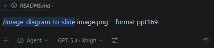

# PPT Master

An AI-driven presentation generation system that converts source documents into natively editable PPTX files via multi-role collaboration.

---

## Supported Input Formats

| Format | File / Source |
|--------|--------------|
| PDF | `.pdf` |
| Word / Office document | `.docx`, `.doc`, `.odt`, `.rtf` |
| PowerPoint | `.pptx` |
| Web page / URL | Any `https://` URL|
| Markup & structured text | `.html`, `.epub`, `.ipynb`, `.tex`, `.rst`, `.org`, `.typ` |
| Markdown | `.md` |
| Plain text / conversation | Paste or describe content directly in chat |

---


## Simplified Workflow

```
Source File / URL / Text
        │
        ▼
 1. Convert to Markdown
        │
        ▼
 2. Initialize Project
    └─ projects/<project_name>/
           sources/   ← input files moved here
           images/
           svg_output/
           svg_final/
           exports/
        │
        ▼
 3. Choose a Template
        │
        ▼
 4. Strategist — Eight Confirmations
    (canvas, page count, audience, style,
     colors, icons, typography, images)
        │
        ▼
 5. [Optional] AI Image Generation
        │
        ▼
 6. Executor — SVG Slide Generation
        │
        ▼
 7. Post-processing (run each step sequentially)
    a) python3 skills/ppt-master/scripts/total_md_split.py   projects/<project_name>
    b) python3 skills/ppt-master/scripts/finalize_svg.py     projects/<project_name>
    c) python3 skills/ppt-master/scripts/svg_to_pptx.py      projects/<project_name> -s final
        │
        ▼
 8. Output
    exports/<project_name>_<timestamp>.pptx
```

---

## Project Directory Layout

```
projects/
└── <project_name>/
    ├── sources/       # Original input files (moved here on import)
    ├── images/        # Image assets used in slides
    ├── templates/     # Template files (if a layout template was chosen)
    ├── design_spec.md # Design specification & content outline
    ├── svg_output/    # AI-generated SVG slides (pre-finalization)
    ├── svg_final/     # Finalized SVGs with embedded assets
    └── exports/       # Final PPTX output files
```

---

## Canvas Formats

| Flag | Dimensions | Use Case |
|------|-----------|---------|
| `ppt169` | 1280 × 720 | Standard 16:9 presentations (default) |
| `ppt43` | 1024 × 768 | 4:3 presentations |
| `xhs` | 1242 × 1660 | Xiaohongshu (RED) posts |
| `story` | 1080 × 1920 | Vertical story format |

---

# How to run single file conversion

1. Open GitHub Copilot
2. Set mode to "Agent", set model to GPT-5.4 (XHigh) then type "/image-diagram-to-slide <path_to_input_file> --format <desired_supported_output_format>" and press **Enter**

3. Once completed, the output can be retrieved from projects/<project_name>/exports# Quach_FPT
